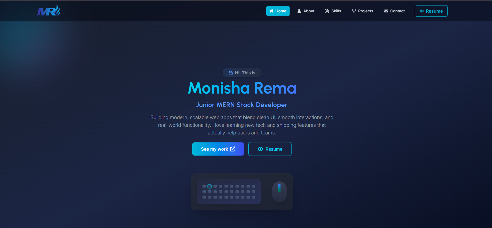

# 💼 Monisha Rema — Portfolio Website

Welcome to my personal developer portfolio! This website is a digital representation of who I am, what I’ve built, and what I can offer as a **Junior MERN Stack Developer**.

## 🚀 Live Demo
🔗 [Visit Live Site](https://portfolio-monisha.surge.sh/)

---

## 📌 About

This portfolio showcases my journey as a web developer, with a strong focus on:

- Clean, component-based UI/UX design
- Scalable full-stack applications
- Real-world problem-solving
- Strong understanding of modern web technologies

---

## 🛠️ Built With

### Frontend
- HTML5, CSS3, JavaScript
- Tailwind CSS,
- React.js, React Router
- Framer Motion
- Accessibility (a11y)

### Tools & Platforms
- Git & GitHub
- Figma, 
- Surge

---

## 💡 Featured Projects

| Project      | Description                                                                 |
|--------------|-----------------------------------------------------------------------------|
| **Planto**   | A plant care assistant for scheduling watering, fertilizing, and monitoring. |
| **Book Case**| A digital bookshelf app with reviews, upvotes, and reading progress tracking.|
| **JobTrack** | An app tracker dashboard that streamlines job search tracking.               |
| **Phudu**    | A medical appointment booking app with schedule and client-side interaction. |

Each project highlights:
- Real-world use cases
- Full-stack integration
- Clean UI and responsive design

---

## 📫 Contact & Connect

Get in touch for collaborations, freelance gigs, or just to say hi!

- ✉️ Email: monisharema97@gmail.com
- 🔗 LinkedIn: [linkedin.com/in/monisharema](https://www.linkedin.com/in/monisha-rema-web-developer/)
- 📱 Phone: +974 3329 6248
- 🐙 GitHub: [github.com/monishaRema](https://github.com/monishaRema)

